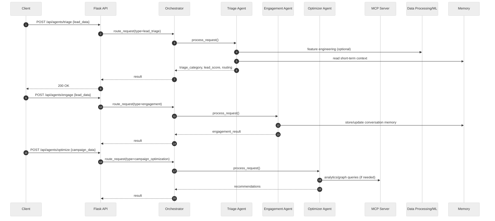

# Backend Overview - Multi-Agent Marketing System

## What this covers
- High-level data flow and components
- Data pipelines and ML steps
- MCP (Model Context Protocol) server role
- Agent orchestration and handoffs

## Core components (backend)
- Flask API (`src/main.py`, `src/routes/*`): request routing, blueprints, static hosting
- Agent layer (`src/agents.py`): Triage, Engagement, Campaign Optimization, Orchestrator
- Data processing (`src/utils/data_processing.py`): ingestion, cleaning, feature engineering, ML
- Memory system (in `DataProcessing.AgentMemorySystem`): short/long-term, episodic, semantic
- MCP server (`src/mcp/mcp_server.py`): JSON-RPC over WebSocket/HTTP to access data resources
- Persistence: SQLite in dev (auto-created in `database/app.db`); Postgres/Redis/Neo4j in Docker

## End-to-end flow
1) Client calls API (e.g., `POST /api/agents/triage`).
2) Flask forwards to Agent Orchestrator → selects target agent.
3) Agent computes using rules/ML features; reads/writes Memory; may call MCP for data/analytics.
4) Result returns via API; optionally triggers handoff to another agent.

### Sequence (triage → engage → optimize)

## Data pipelines and ML
- Ingestion: `DataProcessor.load_data()` loads or synthesizes demo frames (leads, campaigns).
- Cleaning: `clean_data()` deduplicates and forward-fills missing values.
- Feature engineering: `engineer_features()` encodes company size, industry, persona, region, source, then augments with raw columns.
- Training: `MLPipeline.prepare_training_data()` selects engineered features and synthesizes labels (demo). `train_ensemble_models()` trains RandomForest, GradientBoosting, LogisticRegression.
- Prediction: agents currently use rule-based logic; models are prepared for integration.

Files:
- `src/utils/data_processing.py`: `DataProcessor`, `MLPipeline`, `AgentMemorySystem`.

## Memory architecture
- Short-term: keyed by `conversation_id`, with TTL, for context during multi-step conversations.
- Long-term: keyed by `lead_id`, stores preferences and RFM-like scores.
- Episodic: list of episodes (scenario, actions, outcome) for retrieval and learning.
- Semantic: triples `(subject, predicate, object, weight)` for lightweight knowledge graph.

APIs:
- Store: `POST /api/agents/memory/store` (short_term, long_term, episodic, semantic)
- Retrieve: `GET /api/agents/memory/retrieve` (short_term/episodic/semantic)

## MCP server role
- Location: `src/mcp/mcp_server.py` (production WS/HTTP impl), `src/mcp_server.py` (alternate impl).
- Protocol: JSON-RPC 2.0 over WebSocket or HTTP.
- Methods (examples): `getLeadData`, `searchGraph`, `storeMemory`, `recommendAction`, `updateCampaign`, `analyzePerformance`.
- Resource access: `ResourceManager.access_resource()` routes `db://`, `kg://`, `analytics://`, `data://` schemes to handlers.
- Typical usage: Agents or API endpoints call MCP to fetch tabular data, triples, or analytics aggregates without tight coupling to storage.

Example HTTP call path:
- API route posts to `/mcp` with `{jsonrpc, method, params, id}` → MCP validates, dispatches, and returns `result`.

## Agent orchestration and handoffs
- Orchestrator: `AgentOrchestrator` registers agents and routes requests by `type`.
- Handoff rules: lightweight dictionary of conditions/timeouts.
- Triage (`LeadTriageAgent`): classifies and scores; returns routing decision with priority.
- Engagement (`EngagementAgent`): selects channel, generates personalized content, records engagement history.
- Optimizer (`CampaignOptimizationAgent`): analyzes metrics and recommends actions (creative, targeting, budget, auto-pause).
- Handoff: `execute_handoff(source, dest_type, context)` packages `HandoffContext` and calls the destination agent’s `handle_handoff`.

## Persistence model (dev vs docker)
- Dev: SQLite auto-initialized in `database/app.db` via SQLAlchemy; static files served by Flask.
- Docker: Postgres, Redis, Neo4j composed; gunicorn with gevent behind Nginx; Prometheus/Grafana for monitoring.

## Operational health
- Health endpoints:
  - `GET /health` (service)
  - `GET /api/agents/health` (agents + MCP)
  - `GET /api/agents/system/status` (component status)
- Docker healthchecks for web and nginx; Prometheus scrape config provided.

## Where to plug in ML
- Replace rule blocks in agents with `MLPipeline` predictions using engineered features.
- Persist trained models (e.g., joblib) and load in agent constructors.
- Use MCP for heavy analytics joins/aggregations.

## Quick pointers (files)
- API: `src/main.py`, `src/routes/agents.py`, `src/routes/user.py`
- Agents/Orchestrator: `src/agents.py`
- Data/ML/Memory: `src/utils/data_processing.py`
- MCP: `src/mcp/mcp_server.py`
- Docker/Nginx: `docker-compose.prod.yml`, `Dockerfile`, `nginx/nginx.conf`

