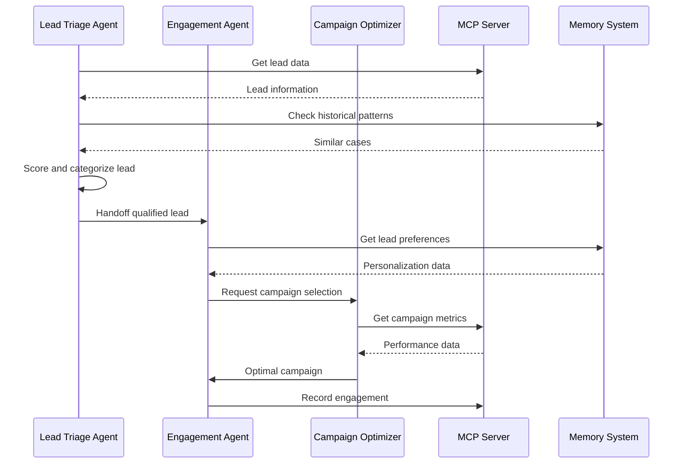
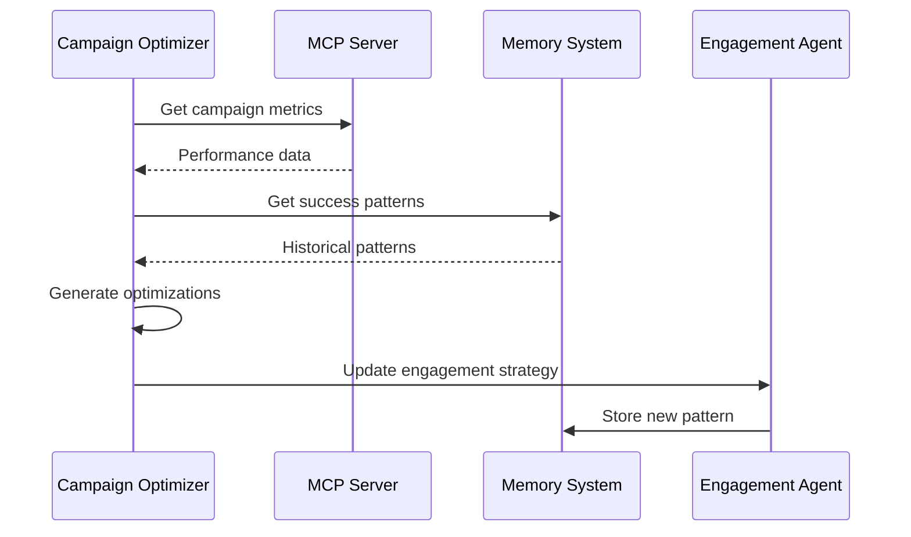
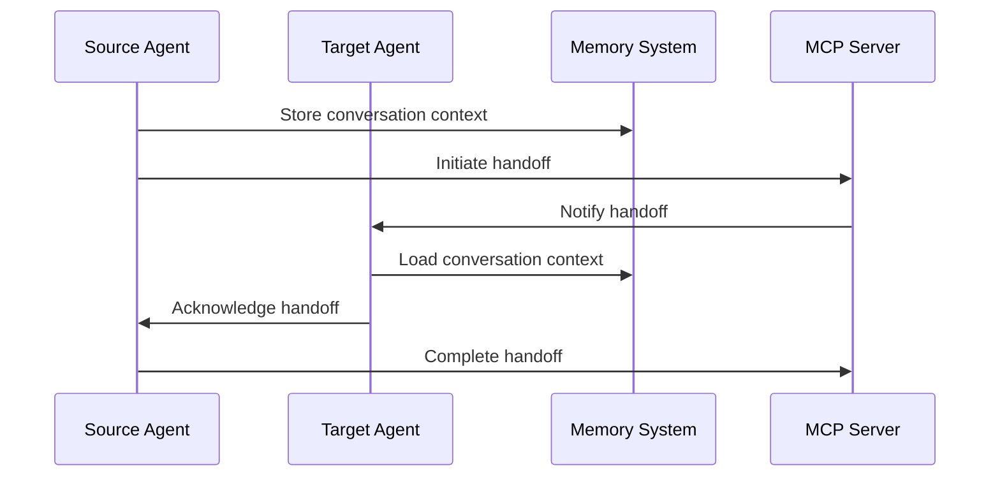
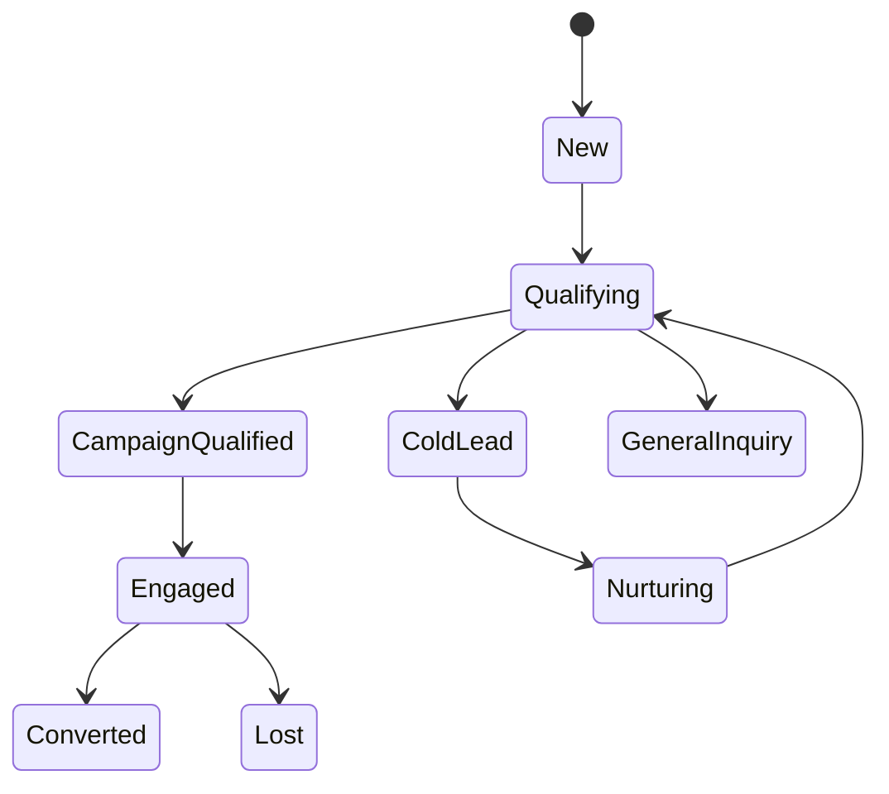
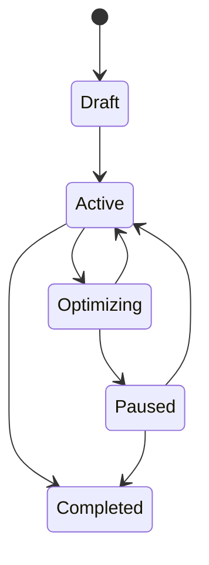
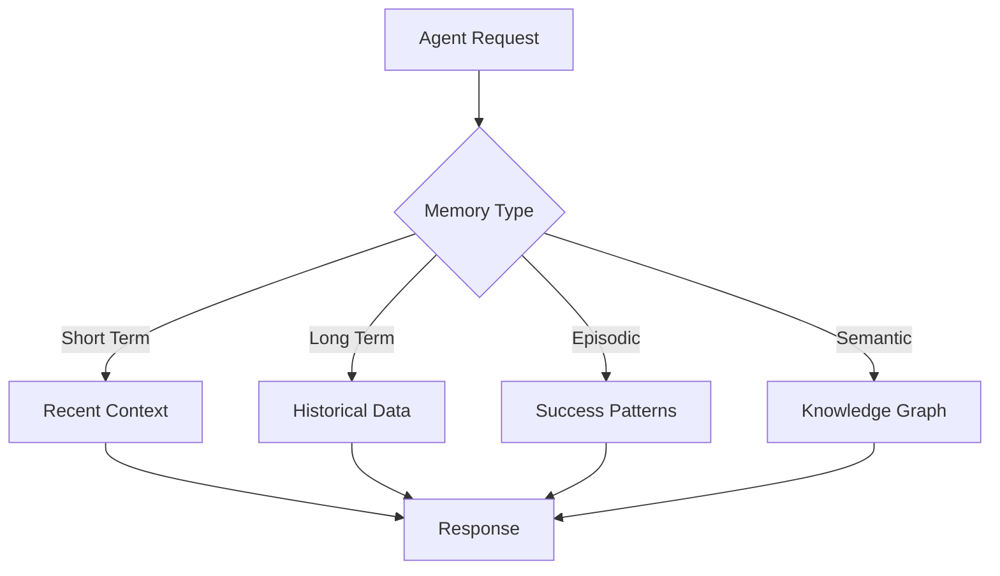
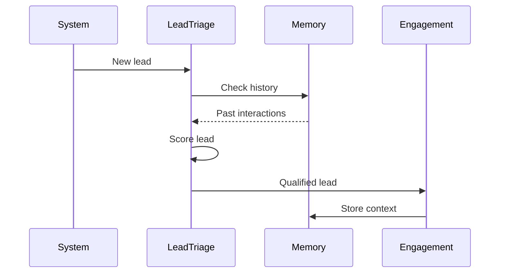
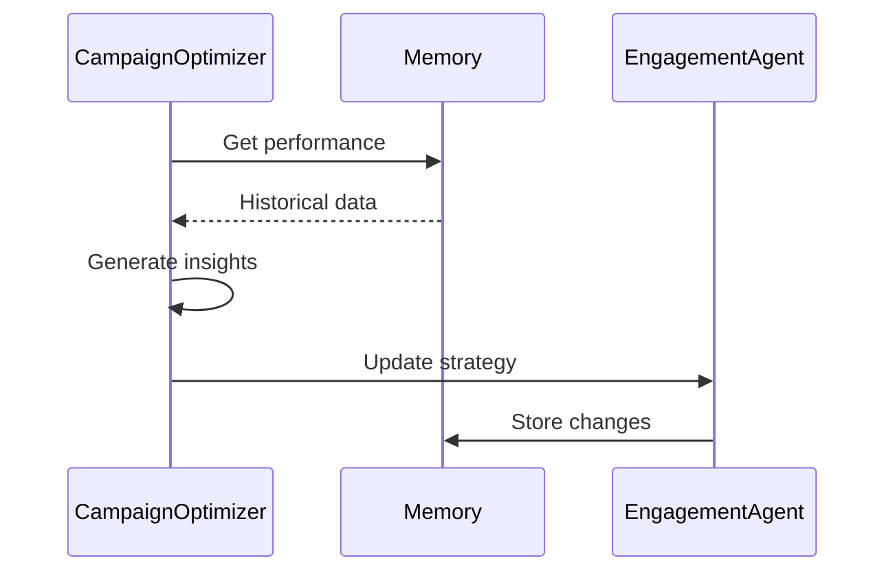

# Agent Interaction Analysis and Conversation Flow

## Overview
This document details the interaction patterns and conversation flows between agents in the Marketing Multi-Agent System. It includes sequence diagrams, state transitions, and handoff protocols.

## Agent Interaction Patterns

### 1. Lead Processing Flow


### 2. Campaign Optimization Flow


### 3. Agent Handoff Protocol


## State Transitions

### Lead States


### Campaign States


## Memory Integration

### Memory Access Patterns


## Conversation Context

### Context Preservation
```json
{
    "conversation_id": "conv_123",
    "lead_id": "lead_456",
    "current_state": {
        "stage": "qualification",
        "confidence": 0.85,
        "last_action": "score_calculation"
    },
    "history": [
        {
            "agent": "lead_triage",
            "action": "initial_scoring",
            "timestamp": "2025-09-01T10:00:00Z"
        }
    ]
}
```

## Best Practices

### 1. Handoff Protocol
1. Context Preservation
   - Store conversation state
   - Include lead history
   - Maintain preferences

2. State Management
   - Atomic transitions
   - Rollback capability
   - Audit logging

3. Error Handling
   - Retry mechanisms
   - Fallback options
   - Error notification

### 2. Memory Usage
1. Access Patterns
   - Cache hot data
   - Batch operations
   - Async updates

2. Optimization
   - Index key fields
   - Compress old data
   - Regular cleanup

3. Security
   - Access control
   - Data encryption
   - Audit trails

## Example Scenarios

### 1. Lead Qualification


### 2. Campaign Optimization


## Performance Considerations

### 1. Response Times
- Agent processing: <500ms
- Memory access: <100ms
- Handoff completion: <1s

### 2. Throughput
- Lead processing: 100/minute
- Campaign updates: 10/minute
- Memory operations: 1000/minute

### 3. Resource Usage
- Memory footprint: <2GB/agent
- CPU utilization: <50%
- Network bandwidth: <100Mbps

## Monitoring

### 1. Key Metrics
- Handoff success rate
- Processing times
- Error rates

### 2. Alerts
- Failed handoffs
- High latency
- Error spikes

### 3. Logging
- Agent operations
- State transitions
- Memory access
